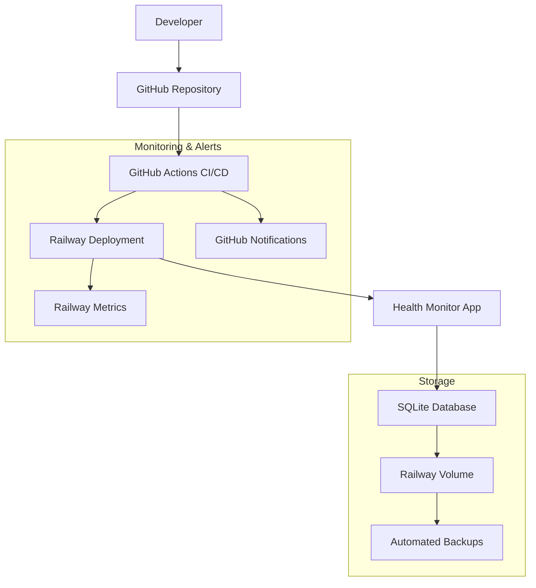

# Deployment Infrastructure Design

## Overview

This design establishes a complete deployment infrastructure for the health monitoring Go application using free tools and services. The solution leverages Railway for hosting, GitHub Actions for CI/CD, and integrated monitoring solutions to provide a robust, cost-effective deployment pipeline suitable for personal use.

## Architecture

### High-Level Architecture



### Technology Stack

- **Hosting Platform**: Railway (free tier: $5/month credit, sufficient for personal use)
- **CI/CD**: GitHub Actions (free for public repos, 2000 minutes/month for private)
- **Database**: SQLite with Railway volume persistence
- **Monitoring**: Railway built-in metrics + GitHub Actions notifications
- **Domain**: Railway-provided subdomain (free)

## Components and Interfaces

### 1. Hosting Platform - Railway

**Rationale**: Railway offers the best balance of features and free tier limits for Go applications:
- $5/month in free credits (enough for personal use)
- Built-in SQLite volume persistence
- Automatic HTTPS
- Simple deployment from GitHub
- Built-in monitoring and logs
- No cold starts (unlike Vercel/Netlify for Go)

**Configuration**:
- Service: Web service with automatic port detection
- Build: Standard Go build process
- Environment: Production environment variables
- Volume: Persistent storage for SQLite database

### 2. CI/CD Pipeline - GitHub Actions

**Workflow Structure**:
```yaml
# .github/workflows/ci-cd.yml
name: CI/CD Pipeline
on:
  push:
    branches: [main]
  pull_request:
    branches: [main]

jobs:
  test:
    # Run on all branches
  deploy:
    # Run only on main branch after tests pass
```

**Pipeline Stages**:
1. **Test Stage** (all branches):
   - Go version setup
   - Dependency installation
   - Code generation (templ, sqlc)
   - Unit tests execution
   - Integration tests
   - Test coverage reporting

2. **Deploy Stage** (main branch only):
   - Build verification
   - Railway deployment trigger
   - Health check verification
   - Rollback on failure

### 3. Database Persistence

**SQLite with Railway Volumes**:
- **Volume Mount**: `/data` directory for database files
- **Database Path**: `/data/health-monitor.db`
- **Backup Strategy**: Railway automatic volume snapshots
- **Migration**: Automatic on application startup using Goose

**Configuration**:
```go
// Environment-based database path
dbPath := os.Getenv("DB_PATH")
if dbPath == "" {
    if os.Getenv("RAILWAY_ENVIRONMENT") != "" {
        dbPath = "/data/health-monitor.db"
    } else {
        dbPath = "health-monitor.db"
    }
}
```

**Migration Strategy**:
- **Embedded Migrations**: Migration files embedded in production binary using Go embed
- **Automatic Execution**: Migrations run automatically on application startup
- **Version Tracking**: Goose migration version tracking in database
- **Failure Handling**: Application startup blocked if migrations fail
- **Logging**: Detailed migration status and error logging

### 4. Environment Configuration

**Environment Variables**:
- `PORT`: Railway auto-assigns (required)
- `DB_PATH`: Database file location
- `RAILWAY_ENVIRONMENT`: Railway environment indicator
- `LOG_LEVEL`: Logging verbosity

**Configuration Management**:
- Development: `.env` file (gitignored)
- Production: Railway environment variables
- Secrets: Railway secret management

### 5. Database Migration Management

**Production Migration Strategy**:
- **Embedded Files**: Migration files embedded in binary using `//go:embed`
- **Startup Execution**: Automatic migration check and execution on app start
- **Version Control**: Goose migration version tracking
- **Safety Checks**: Pre-migration database backup and validation

**Migration Implementation**:
```go
//go:embed migrations/*.sql
var migrationFS embed.FS

func runMigrations(db *sql.DB) error {
    goose.SetBaseFS(migrationFS)
    if err := goose.SetDialect("sqlite3"); err != nil {
        return err
    }
    
    return goose.Up(db, "migrations")
}
```

**Error Handling**:
- Migration failures prevent application startup
- Detailed error logging for debugging
- Database integrity preservation
- Clear recovery instructions

### 6. Monitoring and Alerting

**Railway Built-in Monitoring**:
- CPU and memory usage
- Request metrics
- Error rates
- Deployment status

**GitHub Actions Notifications**:
- Build failures
- Deployment status
- Test results

**Health Checks**:
- Railway automatic health checks on `/health` endpoint
- Custom health check endpoint implementation
- Migration status monitoring

## Data Models

### Deployment Configuration

```go
type DeploymentConfig struct {
    Environment string
    Port        string
    DBPath      string
    LogLevel    string
}

type HealthCheck struct {
    Status    string    `json:"status"`
    Timestamp time.Time `json:"timestamp"`
    Database  bool      `json:"database"`
    Version   string    `json:"version"`
}
```

### CI/CD Configuration

```yaml
# Railway configuration
railway:
  build:
    command: "go build -o bin/server cmd/server/main.go"
  start:
    command: "./bin/server"
  environment:
    - PORT
    - DB_PATH=/data/health-monitor.db
```

## Error Handling

### Deployment Failures

1. **Build Failures**:
   - GitHub Actions fails the pipeline
   - Notifications sent to developer
   - Previous version remains active

2. **Runtime Failures**:
   - Railway automatic restart attempts
   - Health check failures trigger alerts
   - Manual rollback capability

3. **Database Issues**:
   - Migration failures prevent startup
   - Volume corruption recovery from snapshots
   - Graceful degradation for read-only mode

### Monitoring and Recovery

```go
// Health check endpoint
func (h *HealthHandler) HealthCheck(w http.ResponseWriter, r *http.Request) {
    health := HealthCheck{
        Status:    "healthy",
        Timestamp: time.Now(),
        Database:  h.checkDatabase(),
        Version:   h.version,
    }
    
    if !health.Database {
        health.Status = "unhealthy"
        w.WriteHeader(http.StatusServiceUnavailable)
    }
    
    json.NewEncoder(w).Encode(health)
}
```

## Testing Strategy

### CI/CD Testing

1. **Unit Tests**:
   - All handlers and models
   - Database operations
   - Business logic validation

2. **Integration Tests**:
   - End-to-end API testing
   - Database migration testing
   - Template rendering verification

3. **Deployment Testing**:
   - Build verification
   - Health check validation
   - Database connectivity

### Test Configuration

```yaml
# GitHub Actions test matrix
strategy:
  matrix:
    go-version: [1.23]
    os: [ubuntu-latest]

steps:
  - name: Setup Go
    uses: actions/setup-go@v4
    with:
      go-version: ${{ matrix.go-version }}
  
  - name: Install tools
    run: make install-tools
  
  - name: Generate code
    run: make generate
  
  - name: Run tests
    run: make test
```

### Alternative Platforms Considered

1. **Heroku**: No longer offers free tier
2. **Vercel**: Limited Go support, cold starts
3. **Netlify**: Not suitable for Go backends
4. **Fly.io**: Complex setup, limited free tier
5. **Google Cloud Run**: Complex billing, potential charges
6. **AWS Lambda**: Cold starts, complex setup for Go

**Railway Selected Because**:
- Simple deployment process
- No cold starts
- Built-in volume persistence
- Generous free tier
- Excellent Go support
- Integrated monitoring

## Implementation Phases

### Phase 1: Basic Deployment
- Railway service setup
- GitHub repository connection
- Basic environment configuration
- Manual deployment verification

### Phase 2: CI/CD Pipeline
- GitHub Actions workflow creation
- Automated testing setup
- Deployment automation
- Notification configuration

### Phase 3: Production Hardening
- Health check implementation
- Error handling improvements
- Monitoring setup
- Backup verification

### Phase 4: Optimization
- Performance monitoring
- Resource usage optimization
- Cost monitoring setup
- Documentation completion

## Security Considerations

1. **Environment Variables**: Sensitive data in Railway secrets
2. **Database**: SQLite file permissions and volume security
3. **HTTPS**: Automatic Railway SSL certificates
4. **Access Control**: Railway dashboard access management
5. **Secrets Management**: GitHub secrets for deployment tokens

## Cost Analysis

**Monthly Costs (Hobby Plan)**:
- Railway: $5/month hobby plan (already subscribed)
- GitHub Actions: Free (2000 minutes/month)
- Domain: Free Railway subdomain
- Monitoring: Included in Railway
- **Total**: $5/month (existing Railway subscription)

**Usage Estimates**:
- Railway: ~$2-3/month usage within $5 hobby plan
- GitHub Actions: ~100-200 minutes/month
- Storage: <1GB for SQLite database
- **Available headroom**: $2-3/month for future scaling

This design provides a robust, cost-effective deployment solution that meets all requirements while staying within free tier limits for personal use.